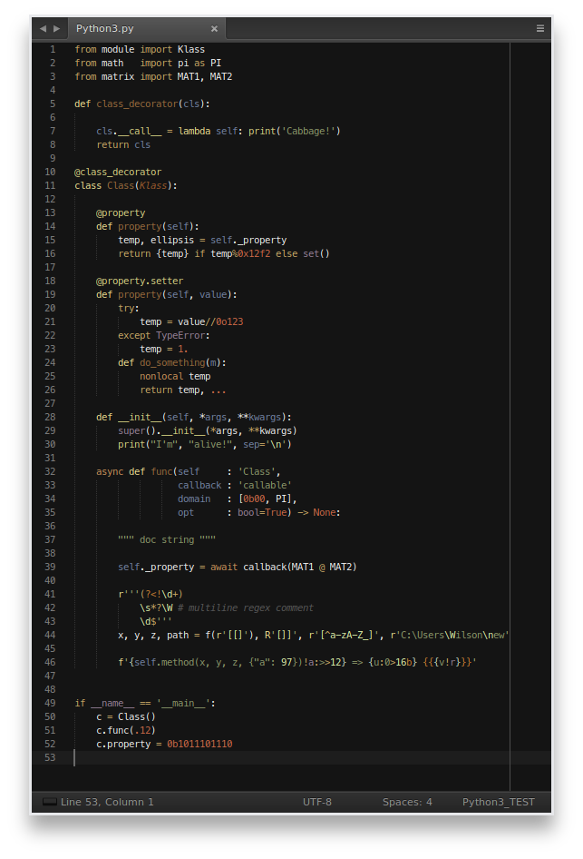

Python and Cython language bundles
==================================

***THE MOST POPULAR AND MOST FEATURE RICH PYTHON SYNTAX HIGHLIGHTER FOR
SUBLIME TEXT WITH [OVER 450,000+ DOWNLOADS AND BEING IN THE TOP 100 PACKAGES](
https://sublime.wbond.net/packages/Python%203))!***

Bleeding-egde Python and Cython syntax highlighters and other goodies for
Sublime Text 2/3 and TextMate editors.

*(Or for any other editor, that is using the `.tmLanguage` syntax definition)*

State of the Art
----------------

Below are some of the most important improvements compared to the existing
syntax highlighters:

- Added better number highlighting:
	- All types of floating point notations are working now;
	- All types of complex number notations are working now;
	- New types of binary and octal-number notations are supported;
	- Long integer is removed.
- The `...` syntax notation of `Ellipsis` is supported now.
- Declaration rules are extended with `nonlocal`.
- *Ex-statements-now-functions* (like `print`) are updated.
- New Exception highlighting added.
- New keywords `async` and `await` added.
- Function annotations are now supported.
- Conventional-language variable `cls` added.
- Optional-comment-based string highlighting:
    - Better regex support (multiline, grouping, comments and more are improved).
    - Format specifier mini-language
    - Template strings
- Matrix multiplication operator
- String and byte literals:
	- Byte notation added;
	- Proper string prefixes added.
- All the unused built-in and magic functions/methods are now removed.
- All the unused keywords and notations are now removed.

Future plans
------------

- Create a better Twilight-based theme file.

Installation
------------

***Via Package Control***

The fastest and easiest way to install these packages for Sublime Text is the
following:

1. Install [Package Control](https://sublime.wbond.net/installation)
2. Open `Tools` → `Command Palette`
3. Select `Package Control: Install Package`
4. Search for `Python 3` and `Cython+` packages and install them
5. Happy coding ;)

***Set as default***

After you installed the language definition file successfully, all you have to
do is assign the `.py` files to always open with this syntax highlighter. Go to

`View` → `Syntax` → `Open all with current extension as...` → `Python 3`

To remove this setting, you can always overwrite this preference.

***Manual installation***

Download the `tmLanguage` files from the python and Cython branches of this
repository. Navigate to your `Packages` folder and create a `Python3` and/or a
`Cython` folder(s) and copy the `tmLanguage` and sublime-build files into.

***Theme file***

*If you want to use my Work-In-Progress theme file: navigate to `Packages/User`
folder and copy `Gloom.tmTheme` into it. Then go to user-settings, and change
your old color theme to the new one.*

Contribute
----------

Any help is appreciated and more than welcome -- my goal is to make this the
*'de facto'* language bundle for python 3. If you want to submit a change,
please use the following conventions when editing the original python files:

- variables uses `underscore_separated_names`;
- all files uses 4 spaces for indentation;
- `=` and `:` operators are aligned if length of variable names are similar;
- `(`, `[` and `{` start a new line, if possible and reasonable;
- each line must fit in the width 80 columns (code, text, etc.);
- comment separators can be easily generated with the `src.utils.separator()`
function

Appreciation
------------

Thank you very much [@joncle](https://github.com/joncle) (Jon Clements) for all
the support in general, [@kms70847](https://github.com/kms70847) (Kevin),
[@Ffisegydd](https://github.com/Ffisegydd) (Keiron Pizzey),
[@schesis](https://github.com/schesis) (Zero Piraeus) and
[@poke](https://github.com/poke) (Patrick Westerhoff) for the feedbacks, and of
course thanks for all the wonderful members of the
[sopython](http://sopython.com) chat room for supporting me in any ways! *May
the Cabbage be with us ;)*

I also want to thank for all the loyal users of this package, and especially
[@rahul-ramadas](https://github.com/rahul-ramadas) (Rahul Ramadas) and
[@bordaigorl](https://github.com/bordaigorl) (Emanuele D'Osualdo) who were
very active on giving me feedbacks, reports, etc.

License
-------

Copyright (C) 2013 - 2017 Peter Varo

This program is free software: you can redistribute it and/or modify it under
the terms of the GNU General Public License as published by the Free Software
Foundation, either version 3 of the License, or (at your option) any later
version.

This program is distributed in the hope that it will be useful, but WITHOUT ANY
WARRANTY; without even the implied warranty of MERCHANTABILITY or FITNESS FOR A
PARTICULAR PURPOSE. See the GNU General Public License for more details.

You should have received a copy of the GNU General Public License along with
this program, most likely a file in the root directory, called 'LICENSE'. If
not, see http://www.gnu.org/licenses.
