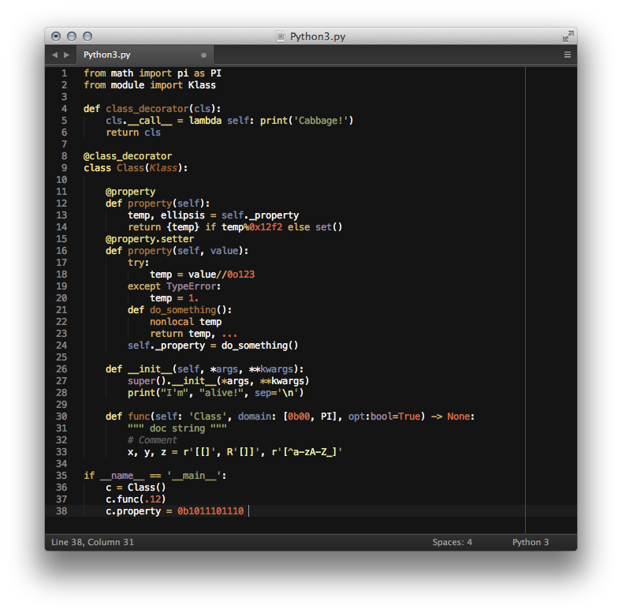

# Python and Cython language bundles

This repo concerns Python 3.3+ and Cython 0.19.1+ related bundles for Sublime Text 2/3 and TextMate editors and for online usage.

### Python 3.3

Python 3.3 is a truly powerful version of Python, with a lot of new and creative features -- with some of them even bringing new and different syntaxes! Sadly, the only available `tmLanguage` and still popular syntax-highlight definition file is pretty old (only supports Python 2.x) and has some annoying bugs. The syntax of these new features then break the full highlighting of the code, not to mention the lack of new built-in keywords and notations and extra unused one.

I believe that a good syntax highlighter for software developers has to be as much help as an auto-complete popup or a code linter script in a text editor.

That's why I implemented a new syntax definition, started from scratch and created especially for Python 3.3 and above. I did this with a Python dictionary plus a little converter script and not in `JSON` (ugly double escape characters -- *Ouch!*) nor in `XML`/`tmLanguage` (com'n is there anyone who likes to read-and-write these?). The result is dynamic, reuseable and easy-to-read and write (syntax highlighted regexes -- with comments and variables!). It is also simple to maintain and pretty short (old: 3331 lines, new: 1226 lines).

### Cython support

Unfortunately Cython syntax highlighter definitions also lack updated, fully-working and 100% Python compatible syntax definitions! I have created a brand-new, highlighter from scratch which is based on the new Python one. One of the future plans is to make this dictionary an addition/extended version of it, so the changes will automatically updated in both language files.

### Highlight on web

***WORK IN PROGRESS***

After used to the syntax highlight in the text editor, sharing the code online with the same colors and highlights is evident! Thanks to Craig Campbell and his amazing [`Rainbow.js`](http://craig.is/making/rainbows/) it is also possible!

*At the moment a few features are missing from Rainbow.js to make it as powerful and complete as the tmLanguage files.. so I wait now :)*

### New is better

Below some of the improvements:

- Added better number highlight:
	- all types of floating point notations are working now
	- all types of complex number notations are working now
	- new types of binary and octal number notations are supported
	- long integer is removed
- The `...` syntax notation of `Ellipsis` is supported now
- Declaration rules are extended with `nonlocal`
- Ex-statements-now-functions (like `print`) are updated
- New exceptions added
- Function annotations are supported
- Language variable `cls` added
- Better regex support (multiline, grouping, comments and more are improved)
- String and byte literals:
	- Byte notation added
	- Proper string prefixes added
- All the unused built-in and magic functions/methods are removed
- All the unused keywords and notations are removed

### Future plans

- Support format mini-language in strings
- Create a better Twilight-based theme file

### Installation

***Via Package Control***

The fastest and easiest way to install theses packages to Sublime Text is the follow:

1. Install [Package Control](https://sublime.wbond.net/installation)
2. Open `Tools` → `Command Palette`
3. Select `Package Control: Install Package`
4. Search for `Python 3` and `Cython+` packages and install them
5. Happy coding ;)

***Set as default***

After you installed the language definition file successfully, all you have to do is assign the `.py` files to always open with this syntax highlighter. Go to

`View` → `Syntax` → `Open all with current extension as...` → `Python 3`

To remove this setting, you can always overwrite this preference.

***Manual installation***

Download the tmLanguage files from the Python and Cython branches of this repository. Navigate to your `Packages` folder and create a `Python3` and/or a `Cython` folder(s) and copy the tmLanguage and sublime-build files into.

***Theme file***

*If you want to use my Work-In-Progress theme file: navigate to `Packages/User` folder and copy `Gloom.tmTheme` into it. Then go to user-settings, and change your old color theme to the new one.*

### Contribute

Any help is appreciated and more than welcome -- my goal is to make the *'de facto'* language bundle for Python 3. If you want to submit a change, please use the following conventions when editing the original python files:

- variables uses `underscore_separated_names`,
- all files uses 4 spaces for indentation,
- `=` and `:` operators are aligned if length of variable names are similar
- `(`, `[` and `{` start a new line, if possible and reasonable
- each line tries to fit in the width 80 columns
- comment separators can be easily generated with the `str_to_separator()`
function

### Appreciation

*Thank you very much Jon Clements for all the support and answers about Python and regexes in general and of course thanks for all the wonderful members of the [**so**python](http://sopython.com) chat room! May the Cabbage be with us ;)*

### MIT LICENSE

The MIT License (MIT)

Copyright (c) 2013-2014 Peter Varo

Permission is hereby granted, free of charge, to any person obtaining a copy of
this software and associated documentation files (the "Software"), to deal in
the Software without restriction, including without limitation the rights to
use, copy, modify, merge, publish, distribute, sublicense, and/or sell copies of
the Software, and to permit persons to whom the Software is furnished to do so,
subject to the following conditions:

The above copyright notice and this permission notice shall be included in all
copies or substantial portions of the Software.

THE SOFTWARE IS PROVIDED "AS IS", WITHOUT WARRANTY OF ANY KIND, EXPRESS OR
IMPLIED, INCLUDING BUT NOT LIMITED TO THE WARRANTIES OF MERCHANTABILITY, FITNESS
FOR A PARTICULAR PURPOSE AND NONINFRINGEMENT. IN NO EVENT SHALL THE AUTHORS OR
COPYRIGHT HOLDERS BE LIABLE FOR ANY CLAIM, DAMAGES OR OTHER LIABILITY, WHETHER
IN AN ACTION OF CONTRACT, TORT OR OTHERWISE, ARISING FROM, OUT OF OR IN
CONNECTION WITH THE SOFTWARE OR THE USE OR OTHER DEALINGS IN THE SOFTWARE.
